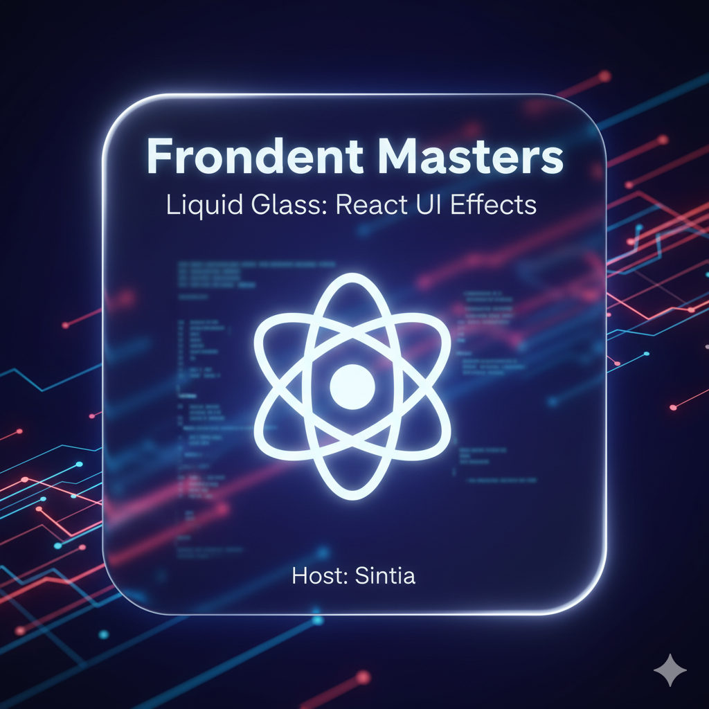

    Preview do Episódio 1

    <audio src="./output/Front-End Masters EP 1.mp3" controls title="Frontend Masters EP 1"></audio>

# Projeto Podcast "Frontend Masters" Gerado por I.A.

> ℹ️ **NOTA:** Este repositório documenta o processo de criação de um podcast de tecnologia ("Frontend Masters") utilizando um fluxo de trabalho baseado em IA.

Projeto com o objetivo de gerar um podcast utilizando ferramentas de IA para cada etapa do processo criativo, desde o roteiro até a arte da capa.

## 💻 Tecnologias utilizadas no projeto

- [**Gemini (Google)**](https://gemini.google.com/) - Para geração do roteiro e da arte da capa.
- [**ElevenLabs**](https://elevenlabs.io/) - Para geração e clonagem de voz (TTS).
- [**Capcut**](https://www.capcut.com/) - Para edição, tratamento de áudio e montagem final.

## ✨ Como foi feito ?

- **Roteiro** gerado via Gemini.
- **Áudio** (narração) gerado pela ElevenLabs.
- **Capa** (arte) gerada pelo Gemini.
- **Edição de Áudio** e montagem com trilha sonora feita no Capcut.

## 📚 Arquivos do Projeto

- **[Roteiro](./input/roteiro.txt)**: O roteiro completo gerado pelo Gemini.
- **[Áudio Final](./output/Front-End%20Masters%20EP%201.mp3)**: O podcast editado e finalizado (MP3).
- **[Capa](./src/capa_ep.png)**: A arte da capa gerada pelo Gemini.

## 🤖 Roteirista e Artista (IA)

    
    
&nbsp&nbsp&nbspGemini 
    &nbsp&nbsp&nbsp
    <a 
        href="https://gemini.google.com/">
        Site Oficial
    </a>
    &nbsp;|&nbsp;
    <a 
        href="https://blog.google/technology/ai/google-gemini-ai/">
        Sobre
    </a>
    &nbsp;|&nbsp;

  

---

⌨️ Feito com 💜 por [Maikon Silva](https://www.linkedin.com/in/maikon-silva-457b98181/) & [Gemini](https://gemini.google.com/)
